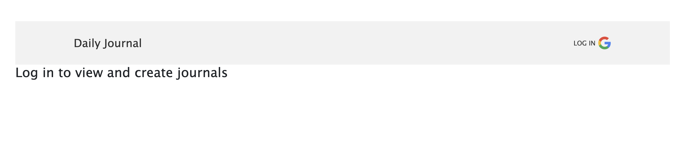
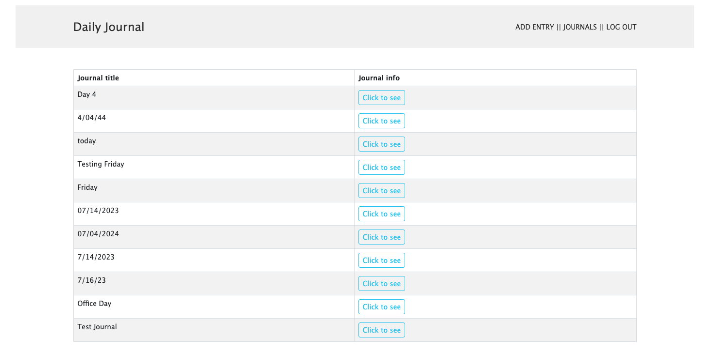
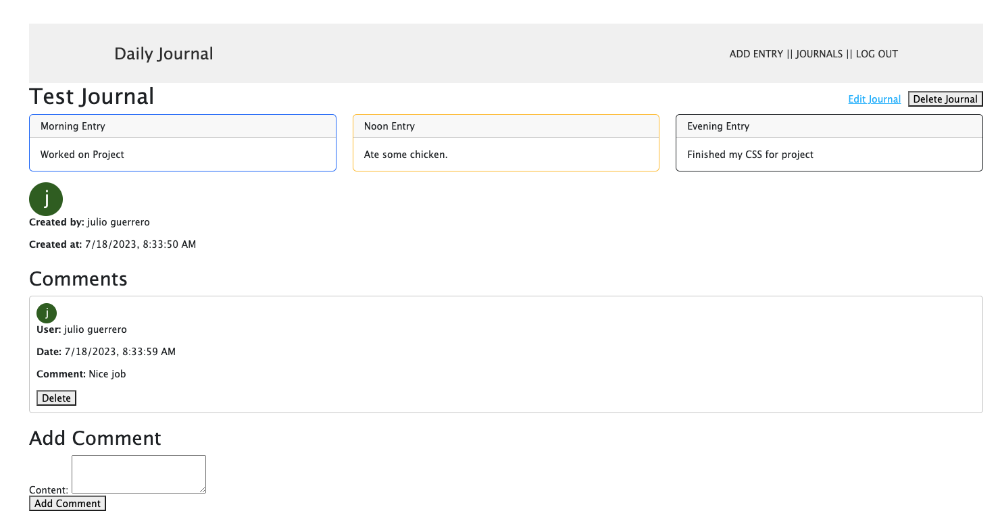

# Daily Journal
**App Use:** Ever want to just jot down what you did today or ideas of what you wanna do? Well you can in three simple categories of Morning, Noon, and Evening. Feel free to write what you did or whatever you have planned and if you did not do it, you can simply edit it with the quick edit function! Changed your mind on your journal post? Go ahead and delete the post! Feel free to comment on your own posts or other people's post as well.

---

**Link to App
[Daily Journal](https://dailyjournal-6aaaa9a51646.herokuapp.com/)

---

## Home page

---

## Logged In
*Logging in will allow you to see other user's journals as well as comment on them. You can make your own journal as well.

---

## A posted Journal

---

## Code Preview
'''js
const commentSchema = new Schema({
  content: {
    type: String,
    required: true
  },
  user: {
    type: Schema.Types.ObjectId,
    ref: 'User',
    required: true
  },
  userName: {
    type: String,
    required: true
  },
  userAvatar: {
    type: String,
    required: true
  }
}, {
  timestamps: true
});
'''

---

## Technologies

**Tested on browsers**

---

## Future Enhancements

[Trello](https://trello.com/b/ZYImv1TB/daily-journal)
- A more energentic homepage
- Allow users to reply to comments
- Notify users if another user replied to their journal or comment